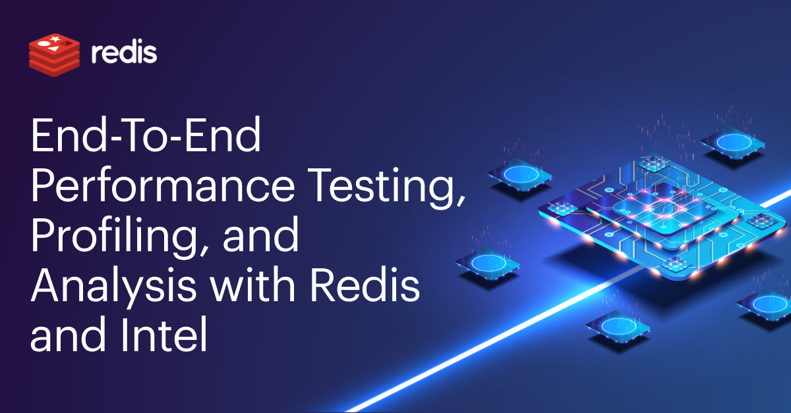

[](https://codecov.io/gh/redis/redis-benchmarks-specification)
[](https://github.com/redis/redis-benchmarks-specification/actions/workflows/tox-self-hosted.yml)
[](https://pypi.org/project/redis-benchmarks-specification)

<!-- toc -->

- [Benchmark specifications goal](#benchmark-specifications-goal)
- [Scope](#scope)
- [Installation and Execution](#installation-and-execution)
  - [Installing package requirements](#installing-package-requirements)
  - [Installing Redis benchmarks specification](#installing-redis-benchmarks-specification-implementations)
  - [Testing out the redis-benchmarks-spec-runner](#testing-out-the-redis-benchmarks-spec-runner)
  - [Testing out redis-benchmarks-spec-sc-coordinator](#testing-out-redis-benchmarks-spec-sc-coordinator)
- [Architecture diagram](#architecture-diagram)
- [Directory layout](#directory-layout)
  - [Specifications](#specifications)
  - [Spec tool implementations](#spec-tool-implementations)
- [Contributing guidelines](#contributing-guidelines)
  - [Joining the performance initiative and adding a continuous benchmark platform](#joining-the-performance-initiative-and-adding-a-continuous-benchmark-platform)
    - [Joining the performance initiative](#joining-the-performance-initiative)
    - [Adding a continuous benchmark platform](#adding-a-continuous-benchmark-platform)
      - [Adding redis-benchmarks-spec-sc-coordinator to supervisord](#adding-redis-benchmarks-spec-sc-coordinator-to-supervisord)
- [Development](#development)
  - [Running formaters](#running-formaters)
  - [Running linters](#running-linters)
  - [Running tests](#running-tests)
- [License](#license)

<!-- tocstop -->


## Benchmark specifications goal

The Redis benchmarks specification describes the cross-language/tools requirements and expectations to foster performance and observability standards around redis related technologies. 

Members from both industry and academia, including organizations and individuals are encouraged to contribute. 

Currently, the following members actively support this project:

- [Redis Ltd.](https://redis.com/) via the Redis Performance Group: providing steady-stable infrastructure platform to run the benchmark suite. Supporting the active development of this project within the company.
- [Intel.](https://intel.com/): Intel is hosting an on-prem cluster of servers dedicated to the always-on automatic performance testing. 

## Scope 

This repo aims to provide Redis related benchmark standards and methodologies for:

- Management of benchmark data and specifications across different setups

- Running benchmarks and recording results

- Exporting performance results in several formats (CSV, RedisTimeSeries, JSON)

- Finding on-cpu, off-cpu, io, and threading performance problems by attaching profiling tools/probers ( perf (a.k.a. perf_events), bpf tooling, vtune )

- Finding performance problems by attaching telemetry probes

Current supported benchmark tools:

- [redis-benchmark](https://github.com/redis/redis)
- [memtier_benchmark](https://github.com/RedisLabs/memtier_benchmark)
- [SOON][redis-benchmark-go](https://github.com/filipecosta90/redis-benchmark-go)


## Installation and Execution

The Redis benchmarks specification and implementations is developed for Unix and is actively tested on it.
To have access to the latest SPEC and Tooling impletamtion you only need to install one python package.<br />
Before package's installation, please install its' dependencies.

### Installing package requirements

```bash
# install pip installer for python3
sudo apt install python3-pip -y
sudo pip3 install --upgrade pip
sudo pip3 install pyopenssl --upgrade

# install docker
sudo apt install docker.io -y

# install supervisord 
sudo apt install supervisor -y
```


### Installing Redis benchmarks specification

Installation is done using pip, the package installer for Python, in the following manner:

```bash
python3 -m pip install redis-benchmarks-specification --ignore-installed PyYAML
```

To run particular version - use its number, e.g. 0.1.57:
```bash
pip3 install redis-benchmarks-specification==0.1.57
```


### Testing out the redis-benchmarks-spec-client-runner

There is an option to run "redis-benchmarks-spec" tests using standalone runner approach. For this option redis-benchmarks-specificaiton should be run together with redis-server in the same time.

```bash
# Run redis server
[taskset -c cpu] /src/redis-server --port 6379 --dir logs --logfile server.log --save "" [--daemonize yes]

# Run benchmark
redis-benchmarks-spec-client-runner --db_server_host localhost --db_server_port 6379 --client_aggregated_results_folder ./test
```

Use taskset when starting the redis-server to pin it to a particular cpu and get more consistent results. 
Option "--daemonize yes" given to server run command allows to run redis-server in background.<br />
Option "--test X.yml" given to benchmark execution command allows to run particular test, where X - test name

Full list of option can be taken with "-h" option:
```
$ redis-benchmarks-spec-client-runner -h
  usage: redis-benchmarks-spec-client-runner [-h]
                                             [--platform-name PLATFORM_NAME]
                                             [--triggering_env TRIGGERING_ENV]
                                             [--setup_type SETUP_TYPE]
                                             [--github_repo GITHUB_REPO]
                                             [--github_org GITHUB_ORG]
                                             [--github_version GITHUB_VERSION]
                                             [--logname LOGNAME]
                                             [--test-suites-folder TEST_SUITES_FOLDER]
                                             [--test TEST]
                                             [--db_server_host DB_SERVER_HOST]
                                             [--db_server_port DB_SERVER_PORT]
                                             [--cpuset_start_pos CPUSET_START_POS]
                                             [--datasink_redistimeseries_host DATASINK_REDISTIMESERIES_HOST]
                                             [--datasink_redistimeseries_port DATASINK_REDISTIMESERIES_PORT]
                                             [--datasink_redistimeseries_pass DATASINK_REDISTIMESERIES_PASS]
                                             [--datasink_redistimeseries_user DATASINK_REDISTIMESERIES_USER]
                                             [--datasink_push_results_redistimeseries] [--profilers PROFILERS]
                                             [--enable-profilers] [--flushall_on_every_test_start]
                                             [--flushall_on_every_test_end]
                                             [--preserve_temporary_client_dirs]
                                             [--client_aggregated_results_folder CLIENT_AGGREGATED_RESULTS_FOLDER]
                                             [--tls]
                                             [--tls-skip-verify]
                                             [--cert CERT]
                                             [--key KEY]
                                             [--cacert CACERT]
  redis-benchmarks-spec-client-runner (solely client) 0.1.61
  ...
```

### Testing out redis-benchmarks-spec-sc-coordinator

Alternative way of running redis-server for listeting is running via redis-benchmarks coordinator.

You should now be able to print the following installed benchmark runner help:

```bash
$ redis-benchmarks-spec-sc-coordinator -h
usage: redis-benchmarks-spec-sc-coordinator [-h] --event_stream_host
                                            EVENT_STREAM_HOST
                                            --event_stream_port
                                            EVENT_STREAM_PORT
                                            --event_stream_pass
                                            EVENT_STREAM_PASS
                                            --event_stream_user
                                            EVENT_STREAM_USER
                                            [--cpu-count CPU_COUNT]
                                            [--platform-name PLATFORM_NAME]
                                            [--logname LOGNAME]
                                            [--consumer-start-id CONSUMER_START_ID]
                                            [--setups-folder SETUPS_FOLDER]
                                            [--test-suites-folder TEST_SUITES_FOLDER]
                                            [--datasink_redistimeseries_host DATASINK_REDISTIMESERIES_HOST]
                                            [--datasink_redistimeseries_port DATASINK_REDISTIMESERIES_PORT]
                                            [--datasink_redistimeseries_pass DATASINK_REDISTIMESERIES_PASS]
                                            [--datasink_redistimeseries_user DATASINK_REDISTIMESERIES_USER]
                                            [--datasink_push_results_redistimeseries]

redis-benchmarks-spec runner(self-contained) 0.1.13

optional arguments:
  -h, --help            show this help message and exit
  --event_stream_host EVENT_STREAM_HOST
  --event_stream_port EVENT_STREAM_PORT
  --event_stream_pass EVENT_STREAM_PASS
  --event_stream_user EVENT_STREAM_USER
  --cpu-count CPU_COUNT
                        Specify how much of the available CPU resources the
                        coordinator can use. (default: 8)
  --platform-name PLATFORM_NAME
                        Specify the running platform name. By default it will
                        use the machine name. (default: fco-ThinkPad-T490)
  --logname LOGNAME     logname to write the logs to (default: None)
  --consumer-start-id CONSUMER_START_ID
  --setups-folder SETUPS_FOLDER
                        Setups folder, containing the build environment
                        variations sub-folder that we use to trigger different
                        build artifacts (default: /home/fco/redislabs/redis-
                        benchmarks-
                        specification/redis_benchmarks_specification/setups)
  --test-suites-folder TEST_SUITES_FOLDER
                        Test suites folder, containing the different test
                        variations (default: /home/fco/redislabs/redis-
                        benchmarks-
                        specification/redis_benchmarks_specification/test-
                        suites)
  --datasink_redistimeseries_host DATASINK_REDISTIMESERIES_HOST
  --datasink_redistimeseries_port DATASINK_REDISTIMESERIES_PORT
  --datasink_redistimeseries_pass DATASINK_REDISTIMESERIES_PASS
  --datasink_redistimeseries_user DATASINK_REDISTIMESERIES_USER
  --datasink_push_results_redistimeseries
                        uploads the results to RedisTimeSeries. Proper
                        credentials are required (default: False)
```

Note that the minimum arguments to run the benchmark coordinator are: `--event_stream_host`, `--event_stream_port`, `--event_stream_pass`, `--event_stream_user`
You should use the provided credentials to be able to access the event streams.
Apart from it, you will need to discuss with the Performance Group the unique platform name that will be used to showcase results, coordinate work, among other thigs.

If all runs accordingly you should see the following sample log when you run the tool with the credentials:

```bash
$ poetry run redis-benchmarks-spec-sc-coordinator --platform-name example-platform \
                                                  --event_stream_host <...> \
                                                  --event_stream_port <...> \
                                                  --event_stream_pass <...> \
                                                  --event_stream_user <...>
2021-09-22 10:47:12 INFO redis-benchmarks-spec runner(self-contained) 0.1.13
2021-09-22 10:47:12 INFO Using topologies folder dir /home/fco/redislabs/redis-benchmarks-specification/redis_benchmarks_specification/setups/topologies
2021-09-22 10:47:12 INFO Reading topologies specifications from: /home/fco/redislabs/redis-benchmarks-specification/redis_benchmarks_specification/setups/topologies/topologies.yml
2021-09-22 10:47:12 INFO Using test-suites folder dir /home/fco/redislabs/redis-benchmarks-specification/redis_benchmarks_specification/test-suites
2021-09-22 10:47:12 INFO Running all specified benchmarks: /home/fco/redislabs/redis-benchmarks-specification/redis_benchmarks_specification/test-suites/redis-benchmark-full-suite-1Mkeys-100B.yml
2021-09-22 10:47:12 INFO There are a total of 1 test-suites in folder /home/fco/redislabs/redis-benchmarks-specification/redis_benchmarks_specification/test-suites
2021-09-22 10:47:12 INFO Reading event streams from: <...>:<...> with user <...>
2021-09-22 10:47:12 INFO checking build spec requirements
2021-09-22 10:47:12 INFO Will use consumer group named runners-cg:redis/redis/commits-example-platform.
2021-09-22 10:47:12 INFO Created consumer group named runners-cg:redis/redis/commits-example-platform to distribute work.
2021-09-22 10:47:12 INFO Entering blocking read waiting for work.
```

You're now actively listening for benchmarks requests to Redis!


## Architecture diagram


In a very brief description, github.com/redis/redis upstream changes trigger an HTTP API call containing the
relevant git information. 

The HTTP request is then converted into an event ( tracked within redis ) that will trigger multiple build variants requests based upon the distinct platforms described in [`platforms`](redis_benchmarks_specification/setups/platforms/). 

As soon as a new build variant request is received, the build agent ([`redis-benchmarks-spec-builder`](https://github.com/filipecosta90/redis-benchmarks-specification/tree/main/redis_benchmarks_specification/__builder__/)) 
prepares the artifact(s) and proceeds into adding an artifact benchmark event so that the benchmark coordinator ([`redis-benchmarks-spec-sc-coordinator`](https://github.com/filipecosta90/redis-benchmarks-specification/tree/main/redis_benchmarks_specification/__self_contained_coordinator__/))  can deploy/manage the required infrastructure and DB topologies, run the benchmark, and export the performance results.
## Directory layout

### Specifications 

  The following is a high level status report for currently available specs.

* `redis_benchmarks_specification`
  * [`test-suites`](https://github.com/filipecosta90/redis-benchmarks-specification/tree/main/redis_benchmarks_specification/test-suites/): contains the benchmark suites definitions, specifying the target redis topology, the tested commands, the benchmark utility to use (the client), and if required the preloading dataset steps.
  
* `redis_benchmarks_specification/setups`
  * [`platforms`](https://github.com/filipecosta90/redis-benchmarks-specification/tree/main/redis_benchmarks_specification/setups/platforms/): contains the standard platforms considered to provide steady stable results, and to represent common deployment targets.
  * [`topologies`](https://github.com/filipecosta90/redis-benchmarks-specification/tree/main/redis_benchmarks_specification/setups/topologies/): contains the standard deployment topologies definition with the associated minimum specs to enable the topology definition.
  * [`builders`](https://github.com/filipecosta90/redis-benchmarks-specification/tree/main/redis_benchmarks_specification/setups/builders/): contains the build environment variations, that enable to build Redis with different compilers, compiler flags, libraries, etc...

### Spec tool implementations

  The following is a high level status report for currently available spec implementations.

* **STATUS: Experimental** [`redis-benchmarks-spec-api`](https://github.com/filipecosta90/redis-benchmarks-specification/tree/main/redis_benchmarks_specification/__api__/) : contains the API that translates the POST HTTP request that was triggered by github.com/redis/redis upstream changes, and fetches the relevant git/source info and coverts it into an event ( tracked within redis ).

* **STATUS: Experimental** [`redis-benchmarks-spec-builder`](https://github.com/filipecosta90/redis-benchmarks-specification/tree/main/redis_benchmarks_specification/__builder__/): contains the benchmark build agent utility that receives an event indicating a new build variant, generates the required redis binaries to test, and triggers the benchmark run on the listening agents.

* **STATUS: Experimental** [`redis-benchmarks-spec-sc-coordinator`](https://github.com/filipecosta90/redis-benchmarks-specification/tree/main/redis_benchmarks_specification/__self_contained_coordinator__/): contains the coordinator utility that listens for benchmark suite run requests and setups the required steps to spin the actual benchmark topologies and to trigger the actual benchmarks.

* **STATUS: Experimental** [`redis-benchmarks-spec-client-runner`](https://github.com/filipecosta90/redis-benchmarks-specification/tree/main/redis_benchmarks_specification/__runner__/): contains the client utility that triggers the actual benchmarks against an endpoint provided. This tool is setup agnostic and expects the DB to be properly spinned beforehand.

## Contributing guidelines

### Adding new test suites

TBD

### Adding new topologies

TBD

### Joining the performance initiative and adding a continuous benchmark platform

#### Joining the performance initiative 
In order to join the performance initiative the only requirement is that you provide a steady-stable infrastructure 
platform to run the benchmark suites, and you reach out to one of the Redis Performance Initiative member via 
`performance <at> redis <dot> com` so that we can provide you with the required secrets to actively listen for benchmark events.

If you check the above "Architecture diagram", this means you only need to run the last moving part of the arch, meaning you will have
one or more benchmark coordinator machines actively running benchmarks and pushing the results back to our datasink.

#### Adding a continuous benchmark platform

In order to be able to run the benchmarks on the platform you need pip installer for python3, and docker.
Apart from it, we recommend you manage the `redis-benchmarks-spec-sc-coordinator` process(es) state via a process monitoring tool like 
supervisorctl, lauchd, daemon tools, or other. 

For this example we relly uppon `supervisorctl` for process managing.


##### Adding redis-benchmarks-spec-sc-coordinator to supervisord

Let's add a supervisord entry as follow
```
vi /etc/supervisor/conf.d/redis-benchmarks-spec-sc-coordinator-1.conf
```
You can use the following template and update according to your credentials:

```bash
[supervisord]
loglevel = debug

[program:redis-benchmarks-spec-sc-coordinator]
command = redis-benchmarks-spec-sc-coordinator --platform-name bicx02 \
                                                  --event_stream_host <...> \
                                                  --event_stream_port <...> \
                                                  --event_stream_pass <...> \
                                                  --event_stream_user <...> \
                                                  --datasink_push_results_redistimeseries \
                                                  --datasink_redistimeseries_host <...> \
                                                  --datasink_redistimeseries_port <...> \
                                                  --datasink_redistimeseries_pass <...> \
                                                  --logname /var/opt/redis-benchmarks-spec-sc-coordinator-1.log
startsecs = 0
autorestart = true
startretries = 1
```

After editing the conf, you just need to reload and confirm that the benchmark runner is active:

```bash
:~# supervisorctl reload
Restarted supervisord
:~# supervisorctl status
redis-benchmarks-spec-sc-coordinator   RUNNING   pid 27842, uptime 0:00:00
```


## Development

1. Install [pypoetry](https://python-poetry.org/) to manage your dependencies and trigger tooling.
```sh
pip install poetry
```

2. Installing dependencies from lock file

```
poetry install
```

### Running formaters

```sh
poetry run black .
```


### Running linters

```sh
poetry run flake8
```


### Running tests

A test suite is provided, and can be run with:

```sh
$ pip3 install -r ./dev_requirements.txt
$ tox
```

To run a specific test:
```sh
$ tox -- utils/tests/test_runner.py
```

To run a specific test with verbose logging:

```sh
$ tox -- -vv --log-cli-level=INFO utils/tests/test_runner.py
```

## License

redis-benchmarks-specification is distributed under the BSD3 license - see [LICENSE](LICENSE)
